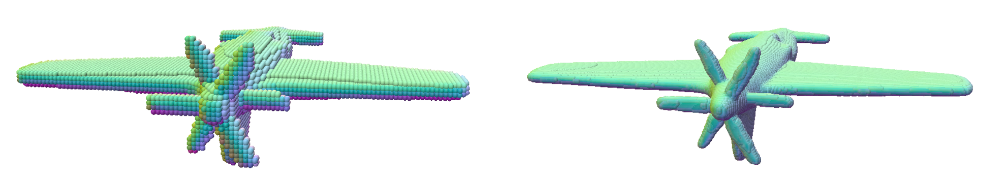

# Misc Details

## Data preparation
XCube takes vdb grids as input. We provide recipes here to process data.

### From Mesh
Please refer [shapenet_example.py](./datagen/shapenet_example.py) for a scripts given shapenet manifold meshes. 
```
python datagen/shapenet_example.py --num_vox 128
python datagen/shapenet_example.py --num_vox 512
```
<!-- (BETA) grid_from_mesh -->



### From Points
```
import fvdb
from xcube.utils.color_util import color_from_points, semantic_from_points

# Note that coarse-level voxel set to True and fine-level voxel set to False
build_splatting = False
voxel_size = YOUR_VALUE
# Note that input_xyz, input_normal, input_semantic are torch tensors of shape [N, 3], [N, 3] and [N, 1] respectively.
if build_splatting:
    target_grid = fvdb.sparse_grid_from_nearest_voxels_to_points(
                    fvdb.JaggedTensor(input_xyz), voxel_sizes=voxel_size, origins=[voxel_size / 2.] * 3)
else:
    target_grid = fvdb.sparse_grid_from_points(
                    fvdb.JaggedTensor(input_xyz), voxel_sizes=voxel_size, origins=[voxel_size / 2.] * 3)

# get target normal
target_normal = target_grid.splat_trilinear(fvdb.JaggedTensor(input_xyz), fvdb.JaggedTensor(input_normal))
target_normal.jdata /= (target_normal.jdata.norm(dim=1, keepdim=True) + 1e-6)

# get target semantics
target_xyz = target_grid.grid_to_world(target_grid.ijk.float()).jdata
target_semantic = semantic_from_points(target_xyz, input_xyz, input_semantic).long()

save_dict = {
    "points": target_grid.to("cpu"),
    "normals": target_normal.cpu(),
    "semantics": target_semantic[:, 0].cpu(),
}
torch.save(save_dict, YOUR_PATH)  
```


## Tips
### Early Dilation (Paper Sec 3.4)
As described above, we recommend using `build_splatting` for the coarse grid. Please be careful about the alignment between your latent space of the fine grid and the coarse grid. When we apply `build_splatting` for the coarse grid, we also turn on `use_hash_tree` in our fine VAE, which performs `build_splatting` for the latent space, ensuring alignment.

### VAE Pretraining
The training dynamics of the VAE can be unstable at the beginning. Please make sure your GPU memory is enough. 
Otherwise, we recommend finetuning your VAE using our provided model (even if the voxel size differs) by specifying the weight you want to finetune from using the `pretrained_weight` parameter. Alternatively, you could train your VAE on coarser grids first and then finetune it on finer grids.