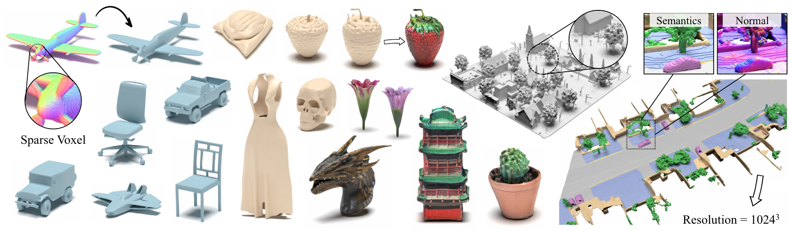

# XCube: Large-Scale 3D Generative Modeling using Sparse Voxel Hierarchies


**XCube: Large-Scale 3D Generative Modeling using Sparse Voxel Hierarchies**<br>
[Xuanchi Ren](https://xuanchiren.com/),
[Jiahui Huang](https://huangjh-pub.github.io/),
[Xiaohui Zeng](https://www.cs.utoronto.ca/~xiaohui/),
[Ken Museth](https://ken.museth.org/Welcome.html),
[Sanja Fidler](https://www.cs.toronto.edu/~fidler/),
[Francis Williams](https://www.fwilliams.info/) <br>
**[Paper](https://arxiv.org/pdf/2312.03806), [Project Page](https://research.nvidia.com/labs/toronto-ai/xcube/)**

Abstract: *We present XCube (abbreviated as <span>X<sup>3</sup></span>), a novel generative model for high-resolution sparse 3D voxel grids with arbitrary attributes. Our model can generate millions of voxels with a finest effective resolution of up to <span>1024<sup>3</sup></span> in a feed-forward fashion without time-consuming test-time optimization. To achieve this, we employ a hierarchical voxel latent diffusion model which generates progressively higher resolution grids in a coarse-to-fine manner using a custom framework built on the highly efficient VDB data structure. Apart from generating high-resolution objects, we demonstrate the effectiveness of XCube on large outdoor scenes at scales of 100m x 100m with a voxel size as small as 10cm. We observe clear qualitative and quantitative improvements over past approaches. In addition to unconditional generation, we show that our model can be used to solve a variety of tasks such as user-guided editing, scene completion from a single scan, and text-to-3D.*

For business inquiries, please visit our website and submit the form: [NVIDIA Research Licensing](https://www.nvidia.com/en-us/research/inquiries/).
For any other questions related to the model, please contact Xuanchi or Jiahui.

## News

- 2024-12-11: Also check out our latest research [InfiniCube](https://research.nvidia.com/labs/toronto-ai/infinicube/), which extends XCube to unbounded 3D generation!
- 2024-10-27: Check out our NeurIPS 2024 work [SCube](https://research.nvidia.com/labs/toronto-ai/scube/) which extends XCube on large-scale scene reconstruction!
- 2024-06-18: Code and model released!

## Environment setup
Note that we currently only support Linux. We welcome support for other platforms.

**(Optional) Install libMamba for a huge quality of life improvement when using Conda**
```
conda update -n base conda
conda install -n base conda-libmamba-solver
conda config --set solver libmamba
```

### Conda Environment
```
# Clone the repository
git clone git@github.com:nv-tlabs/XCube.git
cd XCube

# Create conda environment
conda env create -f environment.yml
conda activate xcube

# Install fVDB (3D learning framework; require GPU later than Ampere)
git clone https://github.com/AcademySoftwareFoundation/openvdb.git
cd openvdb
git fetch origin pull/1808/head:feature/fvdb
git checkout feature/fvdb
rm fvdb/setup.py && cp ../assets/setup.py fvdb/
cd fvdb && pip install .
cd ../..

# Mesh extraction
cd ext/nksr-cuda
python setup.py develop
cd ../..
```
### Docker Image
For docker users, we suggest using a base image from [here](https://github.com/fwilliams/openvdb/tree/fw/fvdb/fvdb#docker-image), and applying the above conda setup over it.

## Quickstart
Download pretrained checkpoints from [Google Drive](https://drive.google.com/drive/folders/1PEh0ofpSFcgH56SZtu6iQPC8xAxzhmke?usp=drive_link) and put them under `checkpoints`.
Alternatively, we provide a script that could automatically download everything for you (temporarily unavailable):
```
python inference/download_pretrain.py
```

**ShapeNet Inference:**
```
# Chair
python inference/sample_shapenet.py none --category chair --total_len 20 --batch_len 4 --ema --use_ddim --ddim_step 100 --extract_mesh

# Car
python inference/sample_shapenet.py none --category car --total_len 20 --batch_len 4 --ema --use_ddim --ddim_step 100 --extract_mesh

# Plane
python inference/sample_shapenet.py none --category plane --total_len 20 --batch_len 4 --ema --use_ddim --ddim_step 100 --extract_mesh

# Visualize
python visualize_object.py -p results/{YOUR_PATH} -i {YOUR_ID}
```

**Waymo Inference:**
```
# Unconditional sampling
python inference/sample_waymo.py none --total_len 20 --batch_len 4 --ema --use_ddim --ddim_step 100 --extract_mesh

# Single-scan condition (coming soon)

# Visualize
python visualize_scene.py -p results/{YOUR_PATH} -i {YOUR_ID}
```

**Objaverse Inference:**
```
# Text to 3D
python inference/sample_objaverse.py none --batch_len 4 --ema --use_ddim --ddim_step 100 --extract_mesh

# Visualize
python visualize_object.py -p results/{YOUR_PATH} -i {YOUR_ID}
```

> The released code has some differences from the version described in the paper: 
> 1) The refinement network is omitted for cleaner code, which may cause slight variations in the results, but these differences are not significant. 
> 2) The mesh extraction process has been moved from the VAE to post-processing.

We have prepared detailed instructions about data preparation and useful tricks at [XCube MISC](MISC.md).

## Training

Data download links:
- ShapeNet: Data is available on [HuggingFace](https://huggingface.co/datasets/xrenaa/XCube-Shapenet-Dataset/) or [Google Drive](https://drive.google.com/file/d/1PQmSomS1B7UR7wNuqp5RtgkdXo7stKzG/view?usp=sharing). Put the extracted folder as `../data/shapenet`. Or you chould change `_shapenet_path` in the [config](configs/shapenet/data.yaml).
- Waymo: Coming soon

### (Coarse) Stage 1 
**Training autoencoder models:**
```
# ShapeNet chair
python train.py ./configs/shapenet/chair/train_vae_16x16x16_dense.yaml --wname 16x16x16-kld-0.03_dim-16 --max_epochs 100 --cut_ratio 16 --gpus 8 --batch_size 32

# ShapeNet car
python train.py ./configs/shapenet/car/train_vae_16x16x16_dense.yaml --wname 16x16x16-kld-0.03_dim-16 --max_epochs 100 --cut_ratio 16 --gpus 8 --batch_size 32

# ShapeNet plane
python train.py ./configs/shapenet/plane/train_vae_16x16x16_dense.yaml --wname 16x16x16-kld-0.03_dim-16 --max_epochs 100 --cut_ratio 16 --gpus 8 --batch_size 32

# Waymo uncond
python train.py ./configs/waymo/train_vae_32x32x32_dense.yaml --wname 32x32x32-kld-0.03_dim-8 --max_epochs 50 --gpus 8 --batch_size 32 --eval_interval 1
```
**Training latent diffusion models:**
```
# ShapeNet chair
python train.py ./configs/shapenet/chair/train_diffusion_16x16x16_dense.yaml --wname 16x16x16_kld-0.03 --eval_interval 5 --gpus 8 --batch_size 8 --accumulate_grad_batches 4

# ShapeNet car
python train.py ./configs/shapenet/car/train_diffusion_16x16x16_dense.yaml --wname 16x16x16_kld-0.03 --eval_interval 5 --gpus 8 --batch_size 8 --accumulate_grad_batches 4

# ShapeNet plane
python train.py ./configs/shapenet/plane/train_diffusion_16x16x16_dense.yaml --wname 16x16x16_kld-0.03 --eval_interval 5 --gpus 8 --batch_size 8 --accumulate_grad_batches 4

# Waymo uncond
python train_auto.py ./configs/waymo/train_diffusion_32x32x32_dense.yaml --wname 32x32x32_kld-0.03 --eval_interval 1 --gpus 8 --batch_size 16 --accumulate_grad_batches 4 --save_topk 2
```

### (Fine) Stage 2 
**Training autoencoder models:**
```
# ShapeNet chair
python train.py ./configs/shapenet/chair/train_vae_128x128x128_sparse.yaml --wname 512_to_128-kld-1.0 --max_epochs 100 --gpus 8 --batch_size 8 --accumulate_grad_batches 2

# ShapeNet car
python train.py ./configs/shapenet/car/train_vae_128x128x128_sparse.yaml --wname 512_to_128-kld-1.0 --max_epochs 100 --gpus 8 --batch_size 8 --accumulate_grad_batches 2

# ShapeNet plane
python train.py ./configs/shapenet/plane/train_vae_128x128x128_sparse.yaml --wname 512_to_128-kld-1.0 --max_epochs 100 --gpus 8 --batch_size 8 --accumulate_grad_batches 2

# Waymo uncond
python train.py ./configs/waymo/train_vae_256x256x256_sparse.yaml --wname 1024_to_256-kld-0.3 --max_epochs 50 --gpus 8 --batch_size 8 --accumulate_grad_batches 2
```

**Training latent diffusion models:**
```
# ShapeNet chair
python train.py ./configs/shapenet/plane/train_diffusion_128x128x128_sparse.yaml --wname 128x128x128_kld-1.0_normal_cond --eval_interval 5 --gpus 8 --batch_size 8 --accumulate_grad_batches 8 --save_topk 2 --save_every 30

# ShapeNet car
python train.py ./configs/shapenet/car/train_diffusion_128x128x128_sparse.yaml --wname 128x128x128_kld-1.0_normal_cond --eval_interval 5 --gpus 8 --batch_size 8 --accumulate_grad_batches 8 --save_topk 2 --save_every 30

# ShapeNet plane
python train.py ./configs/shapenet/car/train_diffusion_128x128x128_sparse.yaml --wname 128x128x128_kld-1.0_normal_cond --eval_interval 5 --gpus 8 --batch_size 8 --accumulate_grad_batches 8 --save_topk 2 --save_every 30

# Waymo uncond
python train.py ./configs/waymo/train_diffusion_256x256x256_sparse.yaml --wname 256x256x64_kld-0.3_semantic_cond --eval_interval 1 --gpus 8 --batch_size 8 --accumulate_grad_batches 4 --save_topk 1
```

In addition, you can manually specify different training settings to obtain models that suit your needs. Common flags include:
- `--wname`: Additional experiment name to specify for wandb logger.
- `--batch_size`: num of batch **in total** for `autoencoder` and num of batch **per GPU** for `diffusion`.
- `--logger_type`: we use `wandb` by default; `none` is also supported.

## License

Copyright &copy; 2024, NVIDIA Corporation & affiliates. All rights reserved.
This work is made available under the [Nvidia Source Code License](LICENSE.txt).

## Related Works

- Ren et al. 2024. [SCube: Instant Large-Scale Scene Reconstruction using VoxSplats](https://research.nvidia.com/labs/toronto-ai/scube/).
- Huang et al. 2023. [Neural Kernel Surface Reconstruction](https://research.nvidia.com/labs/toronto-ai/NKSR).
- Williams et al. 2024. [𝑓VDB: A Deep-Learning Framework for Sparse, Large-Scale, and High-Performance Spatial Intelligence](https://arxiv.org/abs/2407.01781).

## Citation

```bibtex
@inproceedings{ren2024xcube,
    title={XCube: Large-Scale 3D Generative Modeling using Sparse Voxel Hierarchies}, 
    author={Ren, Xuanchi and Huang, Jiahui and Zeng, Xiaohui and Museth, Ken and Fidler, Sanja and Williams, Francis},
    booktitle={Proceedings of the IEEE/CVF Conference on Computer Vision and Pattern Recognition},
    year={2024}
}
```
